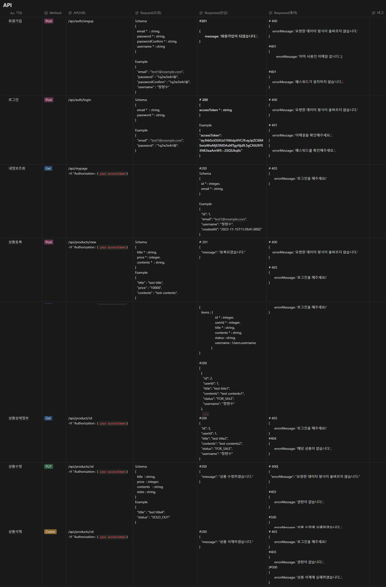
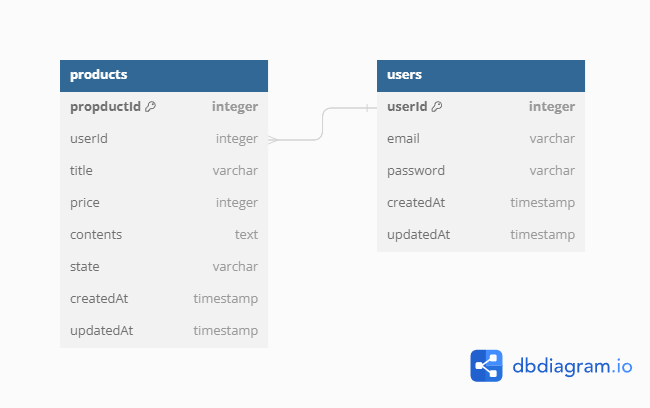

# 더 고민해 보기

1. **암호화 방식**

- 비밀번호를 DB에 저장할 때 Hash를 이용했는데, Hash는 `단방향 암호화`와 `양방향 암호화` 중 어떤 암호화 방식에 해당할까요?
- 비밀번호를 그냥 저장하지 않고 Hash 한 값을 저장 했을 때의 좋은 점은 무엇인가요?

=> 단방향
=> 복호화 하기 힘듭니다.

2. **인증 방식**

- JWT(Json Web Token)을 이용해 인증 기능을 했는데, 만약 Access Token이 노출되었을 경우 발생할 수 있는 문제점은 무엇일까요?
  해당 토큰이 만료되기 전까지 데이터가 노출 될 수 있기 때문에 피해가 발생 될 수 있습니다.

- 해당 문제점을 보완하기 위한 방법으로는 어떤 것이 있을까요?
  유효성이 시간이 긴 Refresh Token 과 기간이 짧은 Access Token을 생성하여 보완 할 수 있습니다.

3. **인증과 인가**

- 인증과 인가가 무엇인지 각각 설명해 주세요.
  인증 : 해당 유저에 대한 신원을 확인 하는 작업.
  인가 : 해당 유저가 데이터를 접근 권한 있는지 확인 하는 작업.

- 과제에서 구현한 Middleware는 인증에 해당하나요? 인가에 해당하나요? 그 이유도 알려주세요.
  isAuthenticated : 해당 유저에 대한 신원을 확인하는 작업을 하고 있습니다.(인증)
  checkProductOwn : Product 수정 및 삭제할 수 있는 권한이 있는지 확인을 하고 있습니다.(인가)

4. **Http Status Code**

- 과제를 진행하면서 `사용한 Http Status Code`를 모두 나열하고, 각각이 `의미하는 것`과 `어떤 상황에 사용`했는지 작성해 주세요.

| 상태코드 |                                                                                                          |
| :------- | :------------------------------------------------------------------------------------------------------- |
| 200      | 클라이언트의 요청을 정상적으로 수행함                                                                    |
| 201      | 클라이언트가 어떠한 리소스 생성을 요청, 해당 리소스가 성공적으로 생성됨(POST를 통한 리소스 생성 작업 시) |
| 400      | 클라이언트의 요청이 부적절 할 경우 사용하는 응답 코드                                                    |
| 401      | 클라이언트가 인증되지 않은 상태에서 보호된 리소스를 요청했을 때 사용하는 응답 코드                       |
| 403      | 유저 인증상태와 관계 없이 응답하고 싶지 않은 리소스를 클라이언트가 요청했을 때 사용하는 응답 코드        |
| 500      | 서버에 문제가 있을 경우 사용하는 응답 코드                                                               |

5. **리팩토링**

- MongoDB, Mongoose를 이용해 구현되었던 코드를 MySQL, Sequelize로 변경하면서, 많은 코드 변경이 있었나요? 주로 어떤 코드에서 변경이 있었나요?
  config / models 수정하였습니다.

- 만약 이렇게 DB를 변경하는 경우가 또 발생했을 때, 코드 변경을 보다 쉽게 하려면 어떻게 코드를 작성하면 좋을 지 생각나는 방식이 있나요? 있다면 작성해 주세요.

Sequelize-cli를 통해 변경을 하면 될 것 같습니다.

6. **서버 장애 복구**

- 현재는 PM2를 이용해 Express 서버의 구동이 종료 되었을 때에 Express 서버를 재실행 시켜 장애를 복구하고 있습니다. 만약 단순히 Express 서버가 종료 된 것이 아니라, AWS EC2 인스턴스(VM, 서버 컴퓨터)가 재시작 된다면, Express 서버는 재실행되지 않을 겁니다. AWS EC2 인스턴스가 재시작 된 후에도 자동으로 Express 서버를 실행할 수 있게 하려면 어떤 조치를 취해야 할까요?
  (Hint: PM2에서 제공하는 기능 중 하나입니다.)

환경 변수를 통해 시작파일에 설정을 하면 좋을 것 같습니다.

7. **개발 환경**

- nodemon은 어떤 역할을 하는 패키지이며, 사용했을 때 어떤 점이 달라졌나요?
  변경 사항이 있을 때 자동으로 서버를 재시작합니다.

- npm을 이용해서 패키지를 설치하는 방법은 크게 일반, 글로벌(`--global, -g`), 개발용(`--save-dev, -D`)으로 3가지가 있습니다. 각각의 차이점을 설명하고, nodemon은 어떤 옵션으로 설치해야 될까요?

일반 : 해당 프로젝트에 필요한 라이브러리를 저장하게 됩니다.

글로벌 : 작업하는 컴퓨터의 모든 곳에 적용이 할 수 있습니다.

개발용 : 배포시에는 사용하지 않지만 개발 시에 필요한 라이브러리를 -D로 이용을 하여 설치합니다.

# 📢 요구사항

테스트 주소 : http://victok.shop/api/~~~

## 1️⃣ 설계 :

### 1. API 명세서 작성

### 2. ERD 작성

## 2️⃣ 개발: 인증 관련 기능

### **회원가입 API**

1. 이메일, 비밀번호, 비밀번호 확인, 이름을 데이터로 넘겨서 **회원가입을 요청**합니다.
   - 보안을 위해 비밀번호는 평문(Plain Text)으로 저장하지 않고 Hash 된 값을 저장합니다.
2. 아래 사항에 대한 **유효성 체크**를 해야 되며, 유효하지 않은 경우 알맞은 Http Status Code와 에러 메세지를 반환해야 합니다.
   - **이메일**: 중복될 수 없으며, 이메일 형식에 맞아야 합니다.
   - **비밀번호:** 최소 6자 이상이며, 비밀번호 확인과 일치해야 합니다.
3. **회원가입 성공 시**, 비밀번호를 제외 한 사용자의 정보를 반환합니다.

### **로그인 API**

1. 이메일, 비밀번호로 **로그인을 요청**합니다.
2. 이메일 또는 비밀번호 중 **하나라도 일치하지 않는다면,** 알맞은 Http Status Code와 에러 메세지를 반환해야 합니다.
3. **로그인 성공 시**, JWT AccessToken을 생성하여 반환합니다.
   - Access Token
     - Payload: userId를 담고 있습니다.
     - 유효기한: 12시간

### 인증 Middleware

1. Request Header의 Authorization 정보에서 JWT를 가져와서, 인증 된 사용자인지 확인하는 Middleware를 구현합니다.
2. 인증에 실패하는 경우에는 알맞은 Http Status Code와 에러 메세지를 반환 해야 합니다.
   - Authorization에 담겨 있는 값의 형태가 표준(Authorization: Bearer <JWT Value>)과 일치하지 않는 경우
   - JWT의 유효기한이 지난 경우
   - JWT 검증(JWT Secret 불일치, 데이터 조작으로 인한 Signature 불일치 등)에 실패한 경우
3. 인증에 성공하는 경우에는 req.locals.user에 인증 된 사용자 정보를 담고, 다음 동작을 진행합니다.

## 3️⃣ **개발:** 사용자 관련 기능 추가

### 내 정보 조회 API (인증 필요 - 인증 Middleware 사용)

1. 인증에 성공했다면, **비밀번호를 제외한 내 정보**를 반환합니다.

## 4️⃣ **개발:** 상품 관련 기능

### 인증 기능 추가

- 인증 필요 API 호출 시 **Request Header**의 \***\*Authorization 값으로 **JWT\*\*를 함께 넘겨줘야 합니다.
- 인증에 실패한 경우, 알맞은 **Http Status Code**와 **로그인이 필요합니다** 라는 에러 메세지를 반환합니다.

### 상품 생성 API (인증 필요 - 인증 Middleware 사용)

- API 호출 시 상품명, 작성 내용 를 전달 받습니다.
  → 작성자명, 비밀번호 대신 인증에 성공한 사용자의 userId를 저장합니다.
- 상품은 두 가지 상태, 판매 중(`FOR_SALE`)및 판매 완료(`SOLD_OUT`) 를 가질 수 있습니다.
- 상품 등록 시 기본 상태는 판매 중(`FOR_SALE`) 입니다.

### 상품 수정 API (인증 필요 - 인증 Middleware 사용)

- 상품명, 작성 내용, 상품 상태 를 데이터로 넘겨 상품 수정을 요청합니다.
  → 인증 기능으로 인해 비밀번호는 필요가 없습니다.
- 수정할 상품과 작성자를 확인한 후, 동일할 때에만 글이 수정되어야 합니다.
  → 인증에 성공한 사용자의 userId와 상품을 등록한 사용자의 userId가 일치할 때에만 **수정**되어야 합니다.
- 선택한 상품이 존재하지 않을 경우, “상품 조회에 실패하였습니다." 메시지를 반환합니다.

### 상품 삭제 API (인증 필요 - 인증 Middleware 사용)

- 로그인한 유저 정보를 데이터로 넘겨 상품 삭제를 요청합니다.
  → 인증 기능으로 인해 비밀번호는 필요가 없습니다.
- 수정할 상품의 작성자와 삭제를 시도한 이용자가 동일할 때만 글이 삭제되어야 합니다.
  → 인증에 성공한 사용자의 userId와 상품을 등록한 사용자의 userId가 일치할 때에만 **삭제**되어야 합니다.
- 선택한 상품이 존재하지 않을 경우, “상품 조회에 실패하였습니다." 메시지를 반환합니다.

### 상품 목록 조회 API

- 상품 ID, 상품명, 작성 내용, 작성자명, 상품 상태, 작성 날짜 조회하기
  - 작성자명을 표시하기 위해서는 상품, 사용자 Table의 JOIN이 필요합니다.
- 상품 목록은 작성 날짜를 기준으로 ~~**내림차순(최신순)** 정렬하기~~
  - QueryString으로 sort 항목을 받아서 정렬 방식을 결정합니다.
  - 들어올 수 있는 값은 ASC, DESC 두가지 값으로 대소문자 구분을 하지 않습니다.
  - ASC는 과거순, DESC는 최신순 그리고 둘 다 해당하지 않거나 값이 없는 경우에는 최신순 정렬을 합니다.

### 상품 상세 조회 API

- 상품 ID, 상품명, 작성 내용, 작성자명, 상품 상태, 작성 날짜 조회하기
  - 작성자명을 표시하기 위해서는 상품, 사용자 Table의 JOIN이 필요합니다.

## 5️⃣ **테스트: API 호출 도구로 동작 확인**

1. Thunder Client, Rest Client 등을 이용하여 구현 한 API가 정상 동작하는지 확인합니다.
2. **`(선택)`** REST Client를 사용한다면, 추후 협업 시 이용할 수 있도록 문서(`.http` or `.rest`)를 작성한 후 소스코드와 함께 Git으로 관리합니다.
   - [REST Client - VS Code 에서 경험하는 가벼운 REST API 문서화와 테스트](https://hudi.blog/vscode-rest-client/)
   - [VS Code 확장 기능 REST API 테스트 도구 추천 - REST Client](https://youtu.be/8FgPxVOGVgk?feature=shared)

## 6️⃣ **배포: 누구나 이용할 수 있도록 하기**

1. **AWS EC2** 인스턴스에 프로젝트를 배포합니다.
2. **PM2**를 이용해 Express 서버가 예상치 않게 종료 되어도 다시 실행되도록 설정합니다.
